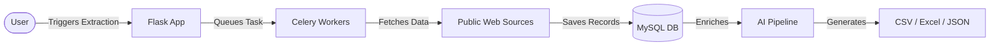

# Data Extractor

A production-minded Flask platform for multi-source business/contact extraction with optional local AI enrichment, validation, and export workflows.

## Important Notice

- This Data Extractor project is for educational purposes only.
- Users are responsible for complying with website terms, privacy rules, and applicable laws when running extraction workflows.

## Overview

Data Extractor helps teams collect structured leads and organization records from multiple public sources, validate contact quality, and export clean datasets.

Core goals:
- Reliable extraction across heterogeneous sources
- Local-first AI support (no cloud API keys required by default)
- Practical data quality controls (deduplication, validation, relevance checks)
- Operational workflow support (task status, stop/retry, history, export)

## Key Features

- Multi-source extraction:
  - Google Maps
  - LinkedIn
  - Yelp
  - Indeed
  - Freelancer
  - Truelancer
  - AI Deep Crawl
  - Government/Nonprofit directory crawl
- Smart list-based extraction with aliases and curated seeds
- Auto-detection of known list types from user keyword input
- Contact extraction for email and phone, including non-email persistence flows
- AI enrichment with provider fallback chain
- Semantic search support over extracted results
- Export to CSV, JSON, and Excel

## Architecture

- Backend: Flask, SQLAlchemy, Flask-Login
- Data store: MySQL
- Queue/cache: Redis (Celery-ready workflow)
- Extraction stack: Playwright, BeautifulSoup, utility crawlers for public web sources (e.g., business directories, professional listings)
- AI stack: Local Ollama / LangExtract (primary), optional OpenAI-compatible or on-prem local model fallback

### System Flow


## AI and LLM Stack Used

This project uses the following AI/LLM components:

- Primary LLM extraction path:
  - LangExtract
  - Ollama (local model serving)
- Primary model configured:
  - Qwen-2.5-VL-7B-Instruct
- Fallback model configured:
  - Llama-3.1-8B-Instruct
- Additional fallback options:
  - OpenAI-compatible endpoint support
  - Optional on-prem local model path
  - Regex fallback for resilience when LLMs are unavailable
- AI/ML utilities:
  - Sentence-Transformers (semantic embeddings)
  - Haystack-AI (retrieval and search workflows)
  - Crawl4AI and Trafilatura (AI-assisted crawling/content extraction)

Default design preference in this project is local-first AI to avoid cloud API key dependency.

## Screenshots / Demo

### Extraction Setup & Dashboard


### Extraction Task Monitoring


### Results View


*(Drag and drop your actual images into the GitHub editor to replace these placeholders!)*

## Project Structure

```text
app/
  ai/                 AI extraction, crawler, semantic search
  extraction/         Source extractors and list-type logic
  routes/             API and web routes
  services/           Validation, export, persistence helpers
  templates/          UI templates
  static/             Frontend assets
migrations/           SQL migration scripts
tests/                Unit/integration tests
run.py                App entry point
requirements.txt      Python dependencies
```

## Quick Start

### 1. Create environment and install dependencies

```bash
python -m venv .venv
source .venv/bin/activate
pip install -r requirements.txt
```

### 2. Configure environment

Create `.env` with at least:

```env
FLASK_ENV=development
SECRET_KEY=change-me

DB_HOST=localhost
DB_USER=root
DB_PASSWORD=your_password
DB_NAME=dataextractor
DB_PORT=3306

REDIS_URL=redis://localhost:6379/0

AI_EXTRACTION_ENABLED=true
AI_LLM_PROVIDER=auto
AI_LLM_API_BASE_URL=http://localhost:11434
AI_PRIMARY_MODEL=Qwen-2.5-VL-7B-Instruct
AI_FALLBACK_MODEL=Llama-3.1-8B-Instruct
```

### 3. Initialize database

```bash
flask db upgrade
# or
mysql -u root -p dataextractor < setup_database.sql
```

### 4. Start required services

```bash
redis-server
ollama serve
python run.py
```

Application default URL:
- http://localhost:5000

## Extraction Modes

- Single source: Run one extractor (example: Google Maps only)
- Both mode: Sequential multi-source flow with quota sharing (Google Maps + LinkedIn)
- List crawl mode: Use curated seed lists for domain-specific discovery
- Auto-detect mode: If keyword matches a known list type, list extraction can run in addition to selected source

## Data Quality and Result Controls

The pipeline includes:
- Record-level validation
- Deduplication by core identifiers (email, phone, website, name+location)
- Relevance checks against requested location
- Optional AI confidence and enrichment fields
- Adjustable max results

Note:
- Actual returned count depends on source availability and validation/relevance filtering.
- Recent tuning increases source fetch headroom to better approach requested max results in filtered pipelines.

## API Surface (High Level)

- Authentication:
  - `POST /auth/register`
  - `POST /auth/login`
- Extraction:
  - `POST /api/extraction/start`
  - `GET /api/extraction/status/<task_id>`
  - `POST /api/extraction/stop/<task_id>`
  - `GET /api/extraction/results/<task_id>`
- Export:
  - `POST /api/export/csv`
  - `POST /api/export/json`
  - `POST /api/export/excel`

## LLM Provider Fallback

When provider is `auto`, extraction attempts providers in fallback order:
1. LangExtract via Ollama
2. OpenAI-compatible endpoint
3. Optional local on-prem model path
4. Regex fallback (always available)

This keeps extraction resilient even when one provider is unavailable.

## Testing

Run selected tests:

```bash
python -m pytest -q
```

Run targeted scripts present in repository root as needed.

## Deployment Notes

For production hardening, configure:
- Environment-based secrets management
- Reverse proxy and TLS
- DB/Redis backup strategy
- Worker process separation (web vs extraction workers)
- Source rate limiting / proxy controls

## License

This project is licensed under the MIT License - see the [LICENSE](LICENSE) file for details.

## Contributing

1. Create a feature branch
2. Make focused changes
3. Add/adjust tests
4. Open a pull request with implementation notes
